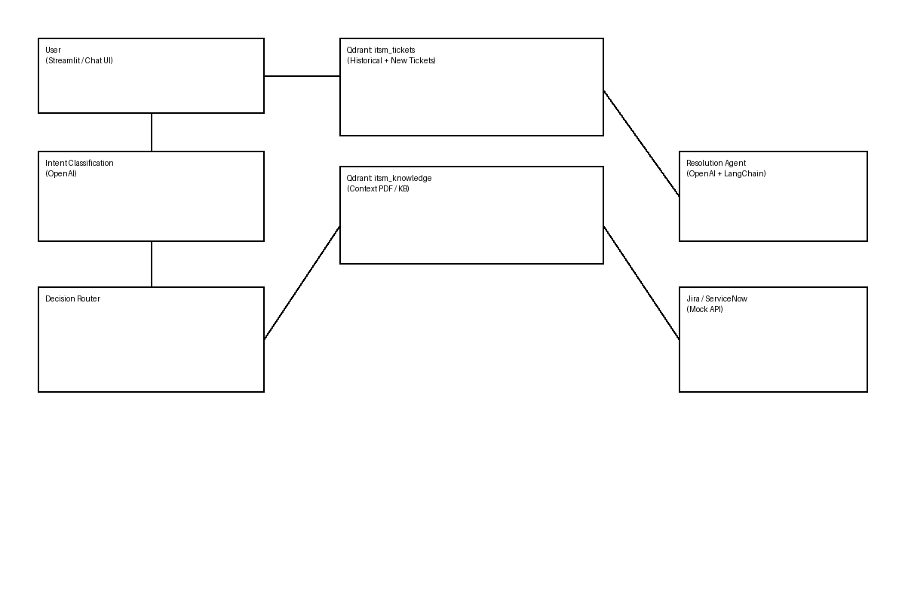

# AI ITSM Copilot – GenAI RAG Demo

## Overview
This repository demonstrates a **GenAI-powered ITSM Copilot** using:

- OpenAI (LLM + embeddings)
- LangChain (RAG orchestration)
- Qdrant (local vector database)
- Streamlit (UI)
- Jira & ServiceNow (mock APIs)

The system can:
- Search similar historical IT tickets
- Detect known vs new issues
- Fall back to internal knowledge (PDF)
- Ask follow-up questions
- Auto-create ITSM tickets
- Continuously learn by ingesting new tickets

---

## Architecture

User → Intent Detection → Ticket Search → Knowledge Search → Resolution → Ticket Creation → Learning Loop

Two Qdrant collections:
- `itsm_tickets`
- `itsm_knowledge`

---

## Setup

### 1. Start Qdrant
```bash
docker run -p 6333:6333 qdrant/qdrant
```

### 2. Install Dependencies
```bash
pip install -r requirements.txt
```

### 3. Load Data
```bash
python ingestion/load_csv_tickets.py
python ingestion/load_pdf_knowledge.py
```

### 4. Run App
```bash
streamlit run app.py
```

---

## Demo Scenarios

### Known Issue
> "VPN not working after password reset"

✔ Found in ticket history  
✔ Resolution shown  
✔ High confidence

### Knowledge-Only Issue
> "Kubernetes latency spikes after autoscaling"

✔ Found in context PDF  
✔ Medium confidence

### New Issue
> "New middleware randomly dropping requests"

❌ Not found  
🎫 Ticket created  
🧠 Auto-ingested for future use

---

## Confidence Scoring
Confidence is derived from vector similarity and source reliability.

- Ticket-based answers → High
- Knowledge-based answers → Medium
- New issue reasoning → Low

---

## Learning Loop
Every resolved issue or created ticket is automatically embedded and stored in Qdrant, ensuring the system improves over time.

---

## Disclaimer
This project is for **demo and educational purposes only**.
Mock APIs are used for Jira and ServiceNow.

---

## License
MIT


## Architecture Diagram



## Use Cases
See `USE_CASES.md` for full details.
